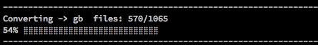

# Convert PNG to ROM art
> Create ```.art``` crc32 format ROM art



## Prerequisites

```shell
# Homebrew
$ ruby -e "$(curl -fsSL https://raw.githubusercontent.com/Homebrew/install/master/install)"

# Node.js
$ brew install node
```

## Installation

```shell
# Navigate to app folder
$ cd app

# Install NPM packages
npm i

# run it
$ npm run dev

# Prompt (If you have not run this script, answer yes)
$ Would you like to run the conversion script now? (Y/n)

# Go have a coffee
# LET THE SCRIPT FINISH
```

## CHMOD
> If the above produces nothing

You may need to enable permissions on 2 files
```
$ cd ../
$ chmod 777 png.sh
$ chmod 777 app/png.sh
```

Run it again
```
$ npm run dev
```

## Completion

Running the above script will produce two (2) folders

* png
* romart

The ```romart``` fodler contains *.art files in the emulator folder it belongs to!

## Testing

Head on over to the great tool [SarahC](https://codepen.io/SarahC/) built on [Code Pen](https://codepen.io/SarahC/pen/dgMLjR)

Upload one of your *.art files from the romart folder

## Authors

* **Eugene Yevhen Andruszczenko** - *Initial and Ongoing Work* - [32teeth](https://github.com/32teeth)

### License

This project is licensed under the Creative Commons Attribution Share Alike 4.0 International - see the [LICENSE.md](LICENSE.md) file for details

### Acknowledgments

* [SarahC](https://codepen.io/SarahC/)


### Support
> We Like Coffee!

[](https://github.com/sponsors/32teeth)


